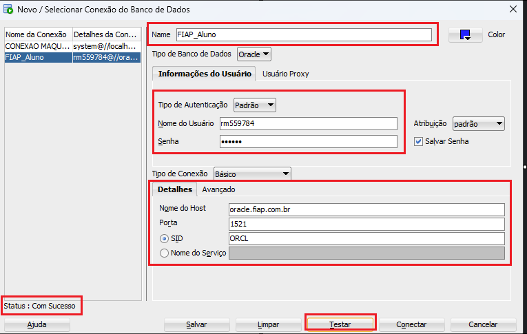

# FIAP - Faculdade de Informática e Administração Paulista
<br/>
<br/>
<p align="center">
<a href= "https://www.fiap.com.br/"></a>
</p>

<br>

# SISTEMA A.T.M (Agricultural Transport Monitoring)

## Grupo 8

## 👨‍🎓 Integrantes: 
- <a href="https://www.linkedin.com/in/a1exlima/">Alex da Silva Lima</a>
- <a href="https://www.linkedin.com/in/johnatanloriano/">Johnatan Sousa Macedo Loriano</a>
- <a href="https://www.linkedin.com/in/matheus-maia-655bb1250/">Matheus Augusto Rodrigues Maia</a>

## 👩‍🏫 Professores:
### Tutor(a) 
- <a href="https://www.linkedin.com/in/lucas-gomes-moreira-15a8452a/">Lucas Gomes Moreira</a>
### Coordenador(a)
- <a href="https://www.linkedin.com/in/profandregodoi/">André Godoi</a>


## 📜 Descrição

#### Introdução

O agronegócio é um dos pilares mais significativos da economia global, especialmente no Brasil, onde desempenha um papel crucial na geração de empregos e no desenvolvimento econômico. O projeto "Sistema A.T.M (Agricultural Transport Monitoring)" visa abordar os desafios enfrentados pelos pequenos e médios produtores rurais, focando na eficiência logística no setor de distribuição e consumo de produtos agrícolas. A proposta integra conceitos de tecnologia e inovação, utilizando Python para desenvolver um sistema de monitoramento dos produtos transportados que otimiza a distribuição. O objetivo é reduzir perdas no transporte, garantindo a qualidade dos produtos, a confiança dos consumidores e o aumento da lucratividade para pequenos e médios produtores.

#### Gestão do Agronegócio em Python

O projeto se concentra nos capítulos 3 a 6, que exploram o uso de Python para resolver problemas específicos do agronegócio. A solução proposta envolve o desenvolvimento de um sistema que utiliza subalgoritmos, estruturas de dados, manipulação de arquivos e conexão com banco de dados para otimizar a logística dos produtos agrícolas no setor de distribuição e consumo.

#### Subalgoritmos e Estruturas de Dados

Os subalgoritmos são fundamentais para a implementação de funções e procedimentos que manipulam dados de transporte. Utilizando listas e dicionários, o sistema armazena e processa informações da cadeia de suprimentos, garantindo que cada etapa do transporte seja monitorada e registrada. Os dados de categorias e produtos são armazenados em arquivos JSON, permitindo fácil acesso e modificação, além de garantir a persistência das informações.

#### Manipulação de Arquivos e Conexão com Banco de Dados

A manipulação de arquivos no sistema é realizada utilizando dicionários e listas para armazenar dados temporários. Os logs de transporte são gerados em arquivos de texto, facilitando o monitoramento e auditoria das operações. A conexão com o banco de dados é fundamental para armazenar e consultar dados críticos de forma segura e eficiente. A estrutura do banco de dados é definida por meio de tabelas para organizar as informações de produtos, origens, destinos e transportes. Este sistema de banco de dados permite uma gestão eficiente e integrada das operações logísticas, assegurando que todas as etapas do transporte sejam registradas e monitoradas adequadamente. A estrutura relacional facilita a consulta e análise dos dados, promovendo a eficiência e segurança das informações armazenadas.

#### Solução Proposta e Inovação

A solução proposta pelo "Sistema A.T.M" visa resolver os problemas de perdas e desperdícios durante o transporte de produtos agrícolas, melhorando a eficiência logística e acesso a mercados maiores. O uso de tecnologias, como subalgoritmos e manipulação de dados, promove a eficiência e competitividade dos pequenos e médios produtores. O sistema permite o monitoramento contínuo das condições de temperatura do transporte, comparando e analisando com os dados pré-cadastrados de cada produto agrícola e verificando se a temperatura monitorada no transporte está dentro dos limites mínimo e máximo. Isso é feito através de logs quando há desvios nas condições ideais, garantindo a qualidade dos produtos até o ponto de venda.

#### Resultados Esperados

Com a implementação do sistema, espera-se uma redução significativa nas perdas de produtos perecíveis, aumento da eficiência logística e melhoria na qualidade dos produtos no ponto de venda.

#### Conclusão

O projeto "Sistema A.T.M" oferece uma abordagem abrangente para os desafios do agronegócio, utilizando Python para desenvolver um sistema de gestão eficiente e escalável no setor de distribuição e consumo. A solução proposta não só melhora a eficiência da cadeia de suprimentos, mas também aumenta a competitividade dos produtores locais. Ao integrar tecnologia e inovação, o projeto contribui para o desenvolvimento sustentável e econômico do setor agrícola, alinhando-se com as tendências globais de digitalização e automação.

## 📁 Estrutura de pastas

Dentre os arquivos e pastas presentes na raiz do projeto, definem-se:

- <b>data</b>: Esta pasta contém o arquivo <i>lista_produtos_agro.json</i>, que armazena dados de categorias e produtos pré-cadastrados utilizados para o registro de transporte. Esses dados são essenciais para a correta operação e monitoramento do sistema.

- <b>models</b>: Contém os scripts Python (<i>.py</i>) responsáveis pelos subalgoritmos, procedimentos e funções que suportam a aplicação principal do projeto. 

- <b>public</b>: Armazena todos os arquivos públicos utilizados para a explicação e desenvolvimento do projeto, como imagens e materiais de referência. 

- <b>scripts</b>: Contém scripts auxiliares para tarefas específicas do projeto, como migração de banco de dados e diagramas de modelagem entidade-relacionamento.

- <b>.env.example</b>: Um arquivo de configuração de exemplo que serve como template para a inserção de dados sensíveis do projeto. Este arquivo é crucial para configurar o ambiente 
de execução de maneira segura.

- <b>.gitignore</b>: Arquivo de configuração do Git que especifica quais arquivos e pastas devem ser ignorados pelo controle de versão.

- <b>app.py</b>: O arquivo principal do projeto, onde está implementado o código base da aplicação em Python.

- <b>log_monitoramento_transporte.txt</b>: Arquivo de texto que registra todos os logs gerados pelo simulador de sensor de temperatura.

- <b>README.md</b>: Arquivo de documentação em formato Markdown que serve como guia e explicação geral sobre o projeto.

- <b>requirements.txt</b>: Lista todas as bibliotecas e dependências Python necessárias para a inicialização e funcionamento do projeto.


## 🔧 Como executar o código

### 📝 Fase 1 - Copiando a aplicação

Clone o projeto para o local desejado em seu computador.

```bash
git clone https://github.com/fiap-small-farmer/atm-agricultural-transport-monitoring.git
```
#
### 🛢 Fase 2 - Preparando o banco de dados

- Usaremos o Oracle Database XE em conjunto com a ferramenta de desenvolvimento Oracle SQL Developer 23.1.1 para criação do banco de dados, caso NÃO tenha instalado ainda em sua máquina, acesse os links abaixo e execute a instalação.

- <a href="https://www.oracle.com/br/database/technologies/xe-downloads.html">Oracle Database XE: Versão gratuita e leve do Oracle Database, ideal para desenvolvimento, implantação e distribuição.</a>
- <a href="https://www.oracle.com/br/database/technologies/xe-downloads.html">SQL Developer 23.1.1: Ferramenta de desenvolvimento que facilita a conexão, consulta, administração e manipulação de dados de forma visual e interativa.</a>
- Após a instalação, acesse o Oracle SQL Developer, no canto superior esquerdo, clique no sinal de + em verde e configure uma nova conexão, seguindo o exemplo abaixo:
  
<br>
<p align="center">
<a href= "https://www.fiap.com.br/"></a>
</p>

- Siga os passos:

1. Informe o nome da conexão.
2. Insira o nome de usuário e senha.
3. Insira os detalhes de conexão, como nome do host, porta e SID.
4. Clique em testar, se o status apresentar: "Com Sucesso", banco de dados está conectado com o servidor.

- Acesse no projeto a pasta scripts e abra o arquivo (script_v1.sql) dentro do Oracle SQL Developer.
- Execute as instruções clicando em F5, após finalizar, verifique se o status de saída apresenta:

```PowerShell
    Table PRODUTO criado.

    Table ORIGEM criado.

    Table DESTINO criado.

    Table TRANSPORTE criado.
```

- Acesse o arquivo .env.example dentro do projeto e renomeie para .env
- Insira dentro do arquivo .env seguindo o exemplo abaixo, o mesmo nome de usuário e senha configurados no banco de dados e dados relacionados os DNS.

```PowerShell
    USER=rmxxxxxx
    PASSWORD=DDMMAA
    DNS=oracle.fiap.com.br:1521/ORCL
```
#
### 👨🏻‍💻 Fase 3 - Preparando a aplicação para execução

Entre na pasta raiz do repositório

```PowerShell
#  Navega para o diretório do projeto no terminal.

cd atm-agricultural-transport-monitoring
```

Execute os comandos:

```PowerShell
# Cria um ambiente virtual isolado para projetos Python, permitindo gerenciar dependências separadamente.

py -m venv venv
```

```PowerShell
# Ativa o ambiente virtual Python no Windows, permitindo usar suas dependências isoladas.

.\venv\Scripts\activate
```

```PowerShell
# Instala todas as dependências listadas no arquivo requirements.txt

pip install -r requirements.txt
```

Execute a aplicação localmente:

```PowerShell
# Executa o arquivo app.py usando o interpretador Python.

python app.py
```


## 🗃 Histórico de lançamentos

* 1.0.0 - 11/10/2024
#
## 📋 Licença

<p xmlns:cc="http://creativecommons.org/ns#" xmlns:dct="http://purl.org/dc/terms/"><a property="dct:title" rel="cc:attributionURL" href="https://github.com/agodoi/template">MODELO GIT FIAP</a> por <a rel="cc:attributionURL dct:creator" property="cc:attributionName" href="https://fiap.com.br">Fiap</a> está licenciado sobre <a href="http://creativecommons.org/licenses/by/4.0/?ref=chooser-v1" target="_blank" rel="license noopener noreferrer" style="display:inline-block;">Attribution 4.0 International</a>.